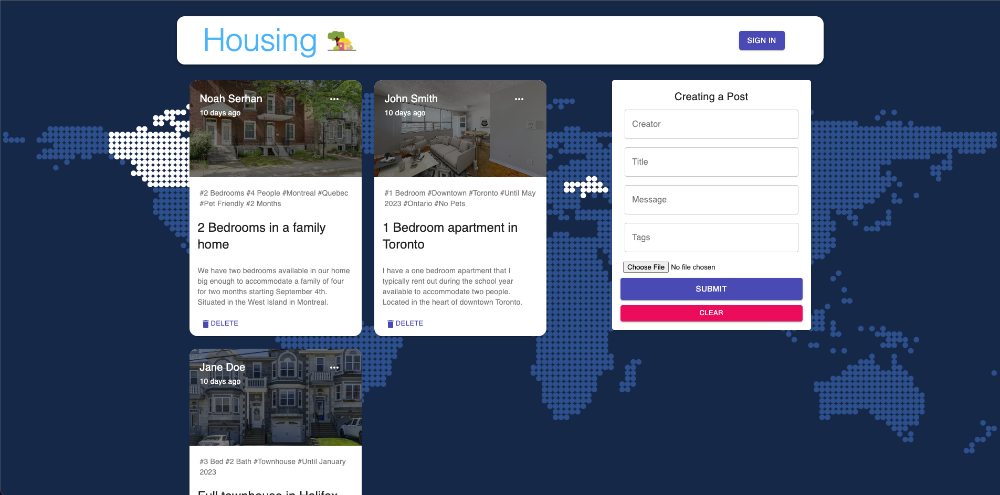

# Ukrainian Refugee Housing Project



Full stack web application built to help Ukrainian refugees find temporary housing in Canada, using MongoDB as the database, the Express.js framework running inside of a Node.js server, and React.js to create the client-side application.

Canadians who have homes with available rooms can post a short description of their home, along with other tags outlining constraints such as duration of the stay, number of rooms, number of bathrooms, and so on.
These posts can be viewed by refuge seekers and the hosts can then be contacted to arrange the stay.

UNFINISHED - While the application functions as intended, the account creation/authentication is still being worked on.

## Setup:
- Fill in missing varaibles in the ```.env``` files for both the client and the server side of the app
- Run ```npm start``` for both the client and server side to start the app
